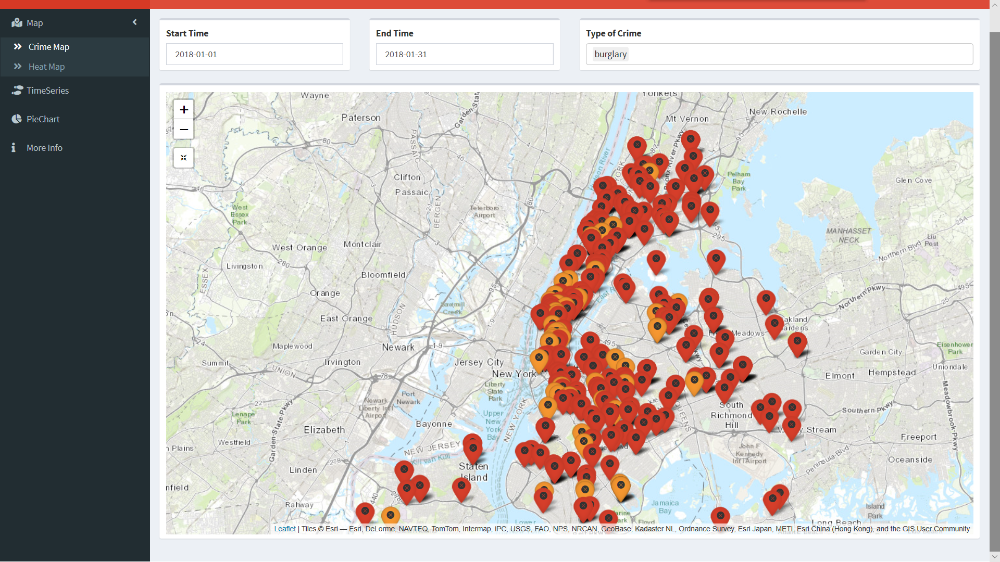
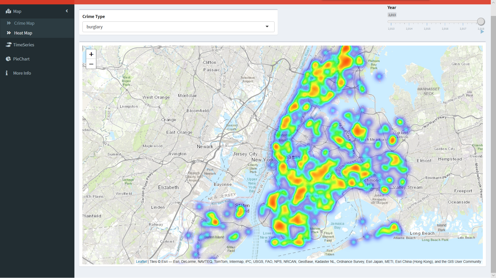
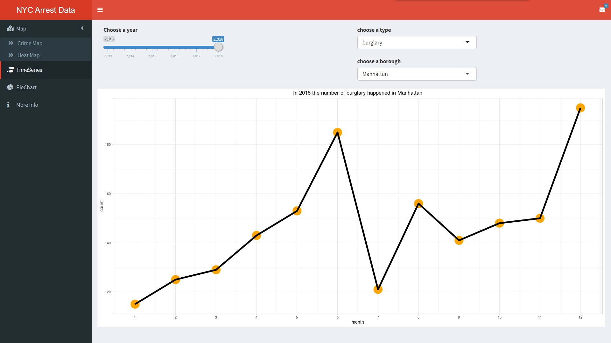
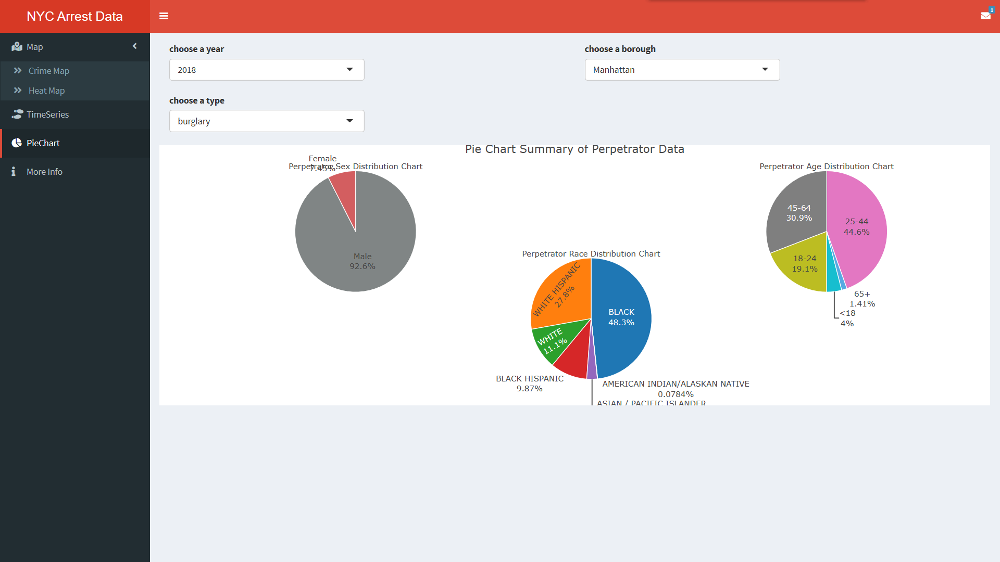
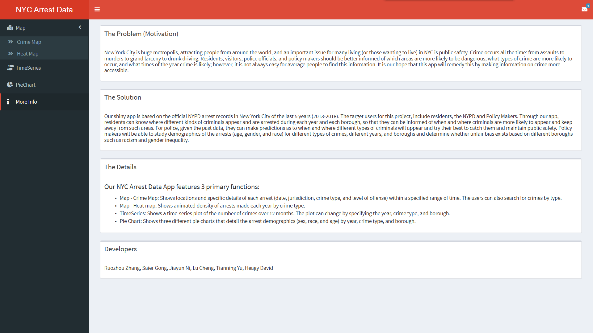

# Project 2: Shiny App Development Version 2.0

### [Project Description](doc/project2_desc.md)








## Project: NYC Arrest Data
+ Term: Spring 2020

+ Team #2
+ Shiny Link: https://saier-gong.shinyapps.io/NYCArrestData/
+ **Team members**：
	+ Lu Cheng
	+ Saier Gong (Presentation)
	+ Jiayun Ni
	+ Tianning Yu
	+ Ruozhou Zhang
	+ David Heagy

+ **Project summary**: In New York, there are usually news about unarrested criminals who have comitted a crime, especially around neighbourhoods, which makes us feel upset. And New York Police are trying their best to keep our residents safe.
  
 	Our shiny app is based on the official NYPD arrest records in New York City of the past 6 years (2013-2018).  The target users for this project, include residents, the NYPD and Policy Makers. Through our app, residents can know where different kinds of criminals appear and are arrested during each year and each borough, so that they can be informed of when and where criminals are more likely to appear and keep away from such areas. For police, given the past data, they can make predictions as to when and where different types of criminals will appear and try their best to catch them and maintain public safety. Policy makers will be able to study demographics of the arrests (age, gender, and race) for different types of crimes, different years, and boroughs and determine whether unfair bias exists based on different boroughs such as racism and gender inequality.


+ **Data Source:** NYC Open Data
  
  https://data.cityofnewyork.us/Public-Safety/NYPD-Arrests-Data-Historic-/8h9b-rp9u/data


+ **Contribution statement**: 
	+ **Lu Cheng** plotted pie charts for different boroughs, years and crime types, and completed the related part of the app.
	+ **Saier Gong** completed the Timeseries Page, both the ui and server parts, together with the plots, and also helped Ruozhou to do data cleaning and debug, and managed the readme file.
	+ **Jiayun Ni** contributed to data selection and theme determination, and put forward the idea of heat map page; was also responsible for the heat map and the animation of heat map part on Map-Heat_Map Page; recleaned and reactivated the data, and coded up ui and server file for the animation process of heat map.
	+ **Tianning Yu** did data collection, page design, testing and debugging.
	+ **Ruozhou Zhang** contributed to the data cleaning process by coding up the Data_Cleaning_Process.R; also coded up the Basic ui structure and the Map-Crime_Map Page; and also contributed to putting all the pages together, as well as optimizing the code for lower time complexity.
	+ **David Heagy** found the dataset on open NYC and contributed ideas for design, and worked on initial piecharts, wrote and edited text in introduction.


Following [suggestions](http://nicercode.github.io/blog/2013-04-05-projects/) by [RICH FITZJOHN](http://nicercode.github.io/about/#Team) (@richfitz). This folder is orgarnized as follows.

```
proj/
├── app/
├── lib/
├── data/
├── doc/
└── output/
```

Please see each subfolder for a README file.
